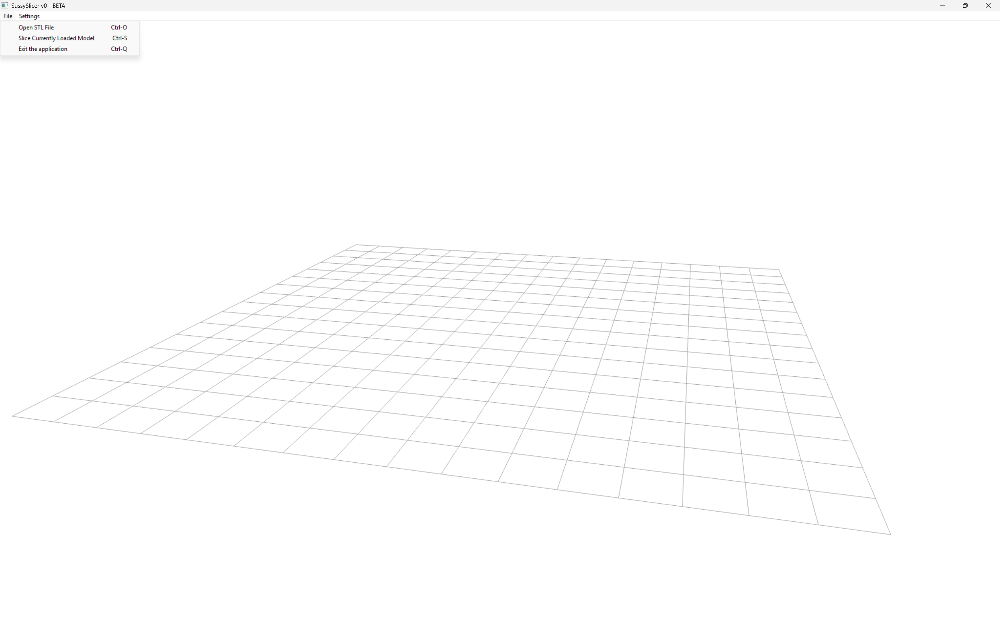
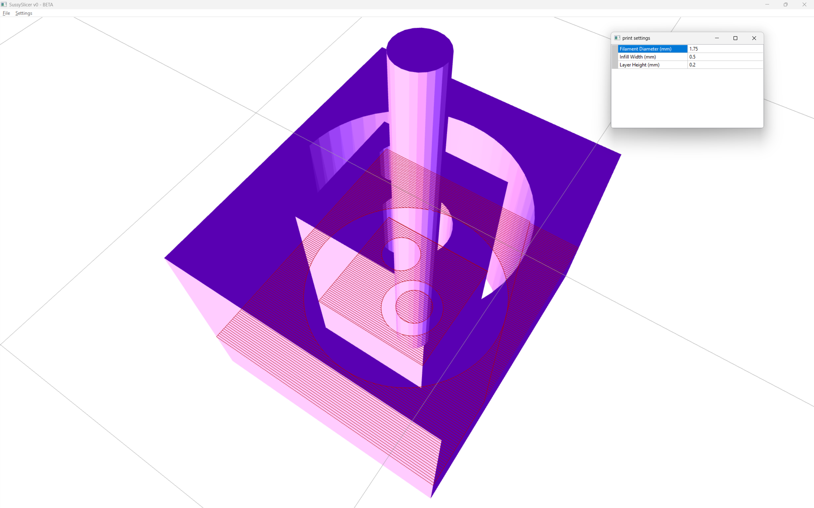

# Description
A basic slicer created in C++ with wxWidgets and openGL

- Capable of solid infill
- Tested in real life
- Only supports ASCII STL files

# Documentation
Brainstorming and slicing pipeline documented in [Onenote](Slicer.one)

# Images

